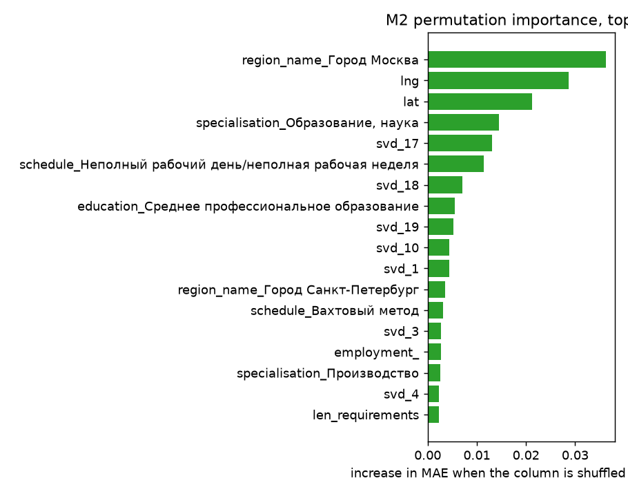
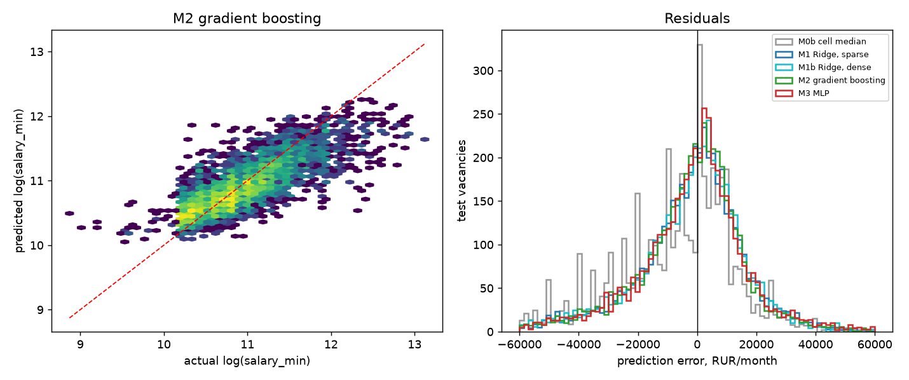

# 基于俄罗斯国家就业开放数据的 IT 岗位薪资预测

**一段话讲完。** 我拿了俄罗斯国家就业门户上发布的 22,387 条招聘广告，问两件事：**到底什么决定薪资**，以及**计算机模型能预测到多准**。第一个问题的答案是「**岗位在哪**」—— 莫斯科的同一份工作，薪资远高于其他地方，地理因素比广告里写的任何要求都重要。第二个问题的答案是「**典型薪资的三分之一左右**」—— 足以判断一个 offer 是否正常，不足以决定该给多少。过程中还发现：「IT 工资更高」几乎完全是假象，真实原因是 IT 岗位集中在本来就贵的城市；而那个时髦的神经网络，输给了一个更简单的模型。

*English: [final_report.md](final_report.md)。数据源、流水线与复现方式见 [README](../README.md)。*

---

## 答案速览

| 问题 | 简短回答 |
|---|---|
| **什么决定薪资？** | 首先是**岗位在哪**。其次是**是什么类型的工作**。广告里*要求什么*反而最不重要。 |
| **预测有多准？** | 误差约为典型薪资的 **35%** —— 比任何简单经验法则都准，但远谈不上精确。 |
| **广告文本值得挖掘吗？** | 必须挖，没有选择 —— 但它不是预测的主要来源。 |
| **存在「IT 溢价」吗？** | 几乎没有。看起来是 11%，但把岗位所在地考虑进去后只剩 **+1%**。 |
| **神经网络值得用吗？** | 不值得。更简单的模型赢了，而且每次都赢。 |

下面每个数字都能用三条命令从入库数据重新生成，见 README 的「如何运行」。

---

## 1. 本研究要回答什么

> **俄罗斯 IT 就业市场中，哪些因素决定薪资水平？能否从岗位文本和结构化属性中准确预测薪资？**

这个问题拆成三个子问题，§2 逐一回答：

| | 子问题 | 回答位置 |
|---|---|---|
| **Q1** | 有多少信息来自结构化字段，又有多少必须从自由文本里挖出来？ | [§2.3](#23-q1--文本值得挖掘吗) |
| **Q2** | 在考虑地区和学历之后，IT 岗位的薪资溢价有多大？ | [§2.4](#24-q2--存在-it-溢价吗) |
| **Q3** | 神经网络值得用吗，还是更简单的模型一样好？ | [§2.5](#25-q3--神经网络值得用吗) |

Q3 是**刻意设计成可以被证伪的**。做一个复杂的东西、报一个好看的数字，是很容易的路；这里的重点是**让答案有可能是"不值得"**。结果确实如此。

---

## 2. 答案

### 2.1 什么决定薪资

> **岗位在哪。然后是这是什么类型的工作。广告里的要求排在最后。**

要找出模型实际依赖哪些列，我把**每一列单独打乱**、其他列保持不变，然后看预测变差了多少。掉得越狠，说明模型越依赖那一列。



最长的三根柱子全都是**地理位置**：莫斯科，然后是经度，然后是纬度。经纬度两根柱子的长度几乎和莫斯科一样 —— 这说明模型**不是死记某一个城市**，而是学到了整张地图上的薪资梯度。

第四名是职业类别，第五名是一个文本成分。**没有任何单项技术** —— 不是 Python，不是 SQL，不是 1С —— 出现在靠前的位置。

**这个排序本身就是结论。** 岗位在哪、是什么类型的工作，压过了招聘广告要求什么。

### 2.2 预测有多准

> **典型薪资 50,000 卢布，误差约 17,500 —— 大概三分之一。够用来判断"这个 offer 正常吗"，不够用来决定"该给这个人多少钱"。**

两个核心指标，先说清楚它们是什么：

- **MAE（平均绝对误差）= 17,478 卢布。** 意思是预测**平均会偏多少**，不看方向。模型预测一个薪资，平均会差一万七千五左右。
- **R² = 0.615。** 一个 0 到 1 的分数，衡量模型解释了多少岗位之间的薪资差异。0 表示"和直接猜平均值一样差"；1 表示完美。0.615 意味着解释了约 62% 的差异。（这个分数可以是负的 —— 下表 M0a 就是负数，表示比瞎猜还差。）

| 模型 | MAE（卢布） | 占中位薪资 | R² |
|---|---:|---:|---:|
| M0a —— 永远猜训练集平均值 | 28,594 | 57.2% | −0.177 |
| M0b —— 按地区和学历分别猜平均值 | 23,674 | 47.3% | 0.187 |
| M1 —— Ridge，使用完整文本词表 | 17,966 | 35.9% | 0.592 |
| M1b —— Ridge，使用压缩后的文本 | 18,264 | 36.5% | 0.588 |
| **M2 —— 梯度提升** | **17,478** | **35.0%** | **0.615** |
| M3 —— 神经网络 | 17,945 | 35.9% | 0.595 |

最好的模型比最强的简单规则改善 **26.2%**。



这张图有两点值得看。

**左图：** 每个点是一个岗位，横轴是真实薪资，纵轴是模型预测的薪资。如果预测完全准确，所有点都会落在红虚线上。实际它们散布在虚线周围一条宽带上 —— **这正是 35% 误差的样子**。另外注意右上角，点云明显变平了：**模型从不敢预测特别高的薪资**。

**右图：** 各模型的误差分布。**每条曲线都略微偏在零的左侧**，意思是每个模型都倾向于**低估**。这是系统性的，有明确原因，§3.2 解释。

**还有一点值得知道：莫斯科要难得多。** 那里的平均误差是 41,657 卢布 —— 是总体数字的两倍以上。首都的薪资差异极大，而广告里没有任何信息能解释这个差异。

作为附带检查，我让模型不预测具体数字、而是把岗位归入四个薪资档位。它 **57.5%** 的情况下判断正确，而"永远猜最常见那一档"是 28.1%。**档位通常判断得对，具体数字很少对。**

### 2.3 Q1 —— 文本值得挖掘吗？

> **必须挖 —— 门户的技能字段四分之三是空的。但别指望它扛起预测。**

结构化 `skills` 字段在 **77.4%** 的记录里为空。从自由文本挖掘至少能抽出一个技能的比例是 36.7%，而结构化字段只有 24.1% —— **挖掘把覆盖率翻了一倍以上**。不挖，任何跟技能有关的问题根本无从回答。

但它对**预测**的贡献有限：

- 把压缩过的文本换成**完整词表**，误差只改善 **1.6%**，仅此而已。
- 没有任何单项技能进入靠前特征。文本只是作为**一堆词的混合体**在起作用。

所以：**必须挖，因为你需要它来描述这个市场；但预测是靠地区和职业撑起来的，不是靠技术关键词。**

**而且最危险的 bug 正藏在这里** —— 见 §3.1。

### 2.4 Q2 —— 存在 IT 溢价吗？

> **几乎没有，只有 1%。看起来像 11%，但那是因为 IT 岗位集中在贵的城市。**

原始对比看起来确实存在溢价。IT 的中位薪资是 50,000 卢布，其他行业是 45,000 —— **高出 11.1%**。

但这个对比不公平。IT 岗位集中在莫斯科和圣彼得堡，且集中在薪资更高的职业里。所以我把"这是不是 IT 岗位"这个标记放进回归，和地区、学历、职业、工作制、技能放在一起 —— 等于在问：**两个其他条件完全相同的岗位，一个 IT 一个不是，IT 那个多拿多少？**

**答案是：+1.0%。**

所以那 11% 不是"因为它是 IT"带来的溢价，而是**"因为它在莫斯科、因为它是高薪类型的工作"**带来的。**莫斯科的 IT 岗位工资高，是因为它在莫斯科。**

剩下那 1% 应当理解为**弱相关**，而不是因果证据。这个对比只控制了本数据集恰好记录到的内容；经验、资历、雇主性质都不在里面。

### 2.5 Q3 —— 神经网络值得用吗？

> **不值得。更简单的模型赢了，而且每一次都赢。**

两个模型拿到的是**完全相同的数据** —— 同样的数字，同样的顺序。唯一的差别是模型类型。

| | 平均误差（卢布） | R² |
|---|---:|---:|
| 梯度提升 | **17,478** | **0.615** |
| 神经网络 | 17,945 | 0.595 |

神经网络从随机值出发，所以跑一次说明不了任何问题。我用 **7 个不同的随机起点**重训了它 7 次。它的分数在 0.595 到 0.605 之间游走 —— 而**更简单的模型在 7 次里全部胜出**，两个指标都是。

诚实的说法是：简单模型赢的幅度，大概就等于神经网络**自身随机性**的宽度。重点不是它碾压了对手。重点是**神经网络除了自己的噪声之外，没有带来任何收益**，却更难解释、更难调参。

---

## 3. 这些答案有多可信

### 3.1 三个本会静默骗过我们的问题

这三个**都不会报错**。每一个都会产出一个看起来合理、实则错误的答案。

**一个表示"没写薪资"的零值。** 雇主没写薪资时，门户填的是**字面值 `0`**（原文 `"от 0"`，即"从 0 起"），而不是留空。**涉及 179 条记录。** 照单全收的话，模型会从"月薪 0 卢布"里认真学习。

**一个名不副实的字段。** `requirement.experience` 文档标注为整数年数。**它不是。** 标着 `0` 的广告要求**最高 35 年**经验，所以 `0` 不可能表示"不需要经验"；另一个取值出现在写着"1 年起"的广告上。这是一个**未公开的内部编码**，所以我**把它从模型里整个删掉了** —— 也就是说，经验这个变量在本数据源上根本不可用。

**那个藏起 43% 技能的西里尔字母 C。** 俄语广告经常用**西里尔字母 С** 写 `C++`，它和拉丁字母 C 长得一模一样，却是不同的字符。标准的"忽略大小写"匹配并不把它们当成同一个：

```python
re.search(r"c\+\+", "C++", re.I)   # 匹配
re.search(r"c\+\+", "С++", re.I)   # 不匹配 —— 静默漏掉
```

全数据集统计：137 个岗位只用拉丁写法，**102 个只用西里尔写法**，100 个两种都用。朴素搜索会漏掉 **43%** 的 C++ 岗位。看似显然的修法 —— 把所有文本改写成同一种字母表 —— 会破坏正常俄语，因为 `с` 是最常用的词之一。所以我们让搜索**同时接受两种字母，但只在真正会发生混淆的位置**。

### 3.2 为什么预测总是偏低一点

再看一眼 §2.2 那张图的右半边：每条误差曲线都偏在零的左侧。**每一个子群体都是如此** —— IT、非 IT、莫斯科、圣彼得堡 —— 平均低估约 **6,900 卢布，即 13.8%**。

这不是某一组的怪癖，而是某个建模选择的直接后果，它有名字。薪资是在**对数尺度**上建模的，也就是按"几倍"而不是按"差多少"来比较。这样拟合出来的模型估计的是薪资分布的**中间值**，而不是**平均值**；而薪资有一小撮特别高的，会把平均值拉上去，于是中间值低于平均值。

标准修正方法叫 **Duan smearing 估计量**。**我没有采用它**，并且在这里明说而不是藏起来：采用了它会改变 §2 里的每一个数字，那是与"如实报告"不同的另一个决定。

### 3.3 一个通常不是区间的"区间"

所有写了薪资的岗位，格式都是 `"от N"` —— "从 N 起"。**没有任何一条**给出上限。而且 **38.5%** 的记录里，存的上限就是下限的副本，完全不含信息。这些上限被丢弃了，模型只预测下限。

---

## 4. 这些答案建立在什么之上

简述如下，细节在 [README](../README.md)。

| | |
|---|---|
| **数据** | 22,387 条广告，来自 Трудвсем 国家就业门户的官方开放数据 —— 12,656 条 IT + 9,731 条其他行业作对照 |
| **清洗后** | 19,578 行 × 72 列，**10 项质量检查全部通过**；移除 446 条完全重复和 2,363 条近似重复的广告 |
| **怎么测的** | 用 2026-08-20 之前发布的广告训练，之后的测试 —— 所以模型是在**向前预测**，而不是在填补已知的空缺 |
| **公平对比** | 三个主要模型拿到的是**完全相同**的数据，所以对比的是模型类型，而不是特征集合 |
| **泄漏检查** | 原始薪资文本字面上就是 `"от <答案>"`。留着它，模型会近乎完美但完全无意义。现在每一列都必须有明确的"进/出"决定 |
| **自动化测试** | 103 项测试，约 16 秒跑完，不需要联网，每次改动都自动执行 |

有两条关于**证据本身**的局限属于这里，而不是 §5，因为它们适用于上面每一个数字：

- **这不是随机样本。** 每次搜索返回的是门户自己的排序，且上限 100 条。这里的一切描述的是**这个样本**。
- **没有调参。** 模型是在合理默认设置下对比的，不是各自最优配置下的对比。

---

## 5. 什么会改变这些答案

1. **随机抽样。** 当前采集是便利样本，本报告没有任何内容能估计真实的全国情况。
2. **能用的日期过滤。** 门户的日期过滤不起作用，所以"之前/之后"切分是唯一对时间变化的控制。
3. **经验数据。** 最有可能提升精度的那个字段，结果是个未公开编码。
4. **§3.2 说的对数修正。** 它会消除系统性 13.8% 的低估，并改变误差数字。
5. **薪资上限。** 在 38.5% 的记录上缺失或无意义，所以只对下限建模。
6. **门户自身的偏向。** 它偏向国企和体力岗位；IT 在其 52.2 万全国岗位中只占少数。结论只在样本所描述的人群内成立。

---

## 术语表

上文中出现的术语，用白话解释。

| 术语 | 在这里是什么意思 |
|---|---|
| **MAE**（平均绝对误差） | 预测平均偏了多少卢布，不看方向。越小越好。 |
| **R²** | 模型解释了多少薪资差异，0（和直接猜平均值一样差）到 1（完美）。模型比瞎猜还差时会是负数。 |
| **基线** | 一个故意做得很笨、用来被超越的规则。M0a 所有岗位都猜同一个数；M0b 按"地区 × 学历"分别猜平均值。 |
| **Ridge 回归** | 带惩罚项的线性回归，惩罚项防止它去死记噪声。 |
| **梯度提升** | 一种模型，建很多棵小决策树，每一棵都在纠正前面那些树的错误。 |
| **MLP**（多层感知机） | 一个小型神经网络。就是这里的 M3。 |
| **时序留出** | 用较老的记录训练、较新的记录测试，所以模型是在向前预测而非填补空缺。 |
| **置换重要性** | 把某一列的值打乱、其他列不动，模型会变差多少。越大说明模型越依赖那一列。 |
| **TF-IDF** | 把文本转成数字的一种方法，突出对这条岗位有区分度的词，而不是仅仅是常见的词。 |
| **SVD 成分** | 文本的压缩替身。模型拿到的不是几千个单词，而是一组数量更少的混合"主题"。 |
| **One-hot 编码** | 把一个类别（比如地区名）变成一组是/否的列。 |
| **泄漏** | 不小心把答案混进了输入。它会给出好看得可疑的分数和一个没用的模型。 |
| **对数尺度** | 按"几倍"（"两倍"）而不是按"差多少"（"多两万"）来比较薪资。 |
| **再变换偏差** | §3.2 解释的那种系统性低估，成因是在对数尺度上建模后又换算回来。 |

---

## 6. 参考资料

| 文档 | 内容 |
|---|---|
| [data_dictionary.md](data_dictionary.md) | 每个字段、填写比例，以及全部实测缺陷 |
| [data_quality_report.md](data_quality_report.md) | 逐行核算、10 项质量检查、修复规则 |
| [model_report.md](model_report.md) | 泄漏审查、完整对比、误差分析、七种子测试 |
| [validation_report.md](validation_report.md) | 自动化测试、测试抓到的两个 bug，以及它们**没有**证明的东西 |

**数据来源：** Трудвсем 开放数据 —— https://opendata.trudvsem.ru/api/v1/vacancies（条款：https://trudvsem.ru/opendata/api）。hh.ru 先被评估并否决，见 README。**许可：** [MIT](../LICENSE)，其中 `data/raw/` 附带单独的数据来源说明。
