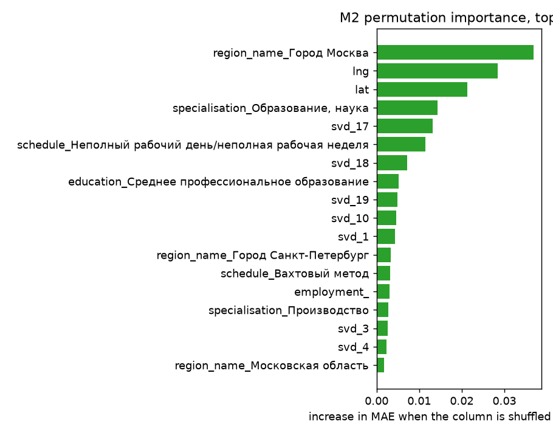
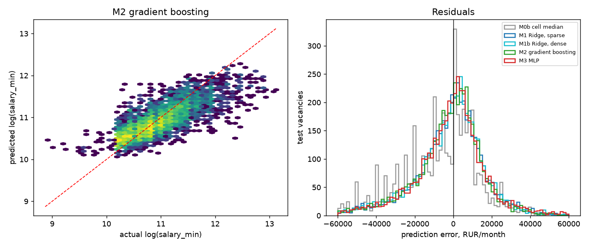

# Model report — Stage 3

Generated by `train_models.py`. Every figure is computed from the data.

- Rows used: **19,399** (of 19,578 in the table; rows without a salary are excluded)
- Temporal split at **2026-08-20**: train 14,513 / test 4,886
- Test-set median salary: **49,999 RUR/month**

## 1. Why the split is temporal

Train is the older 75% of postings by `creation_date`; test is the newest
25%. Random K-fold would be invalid here for two independent reasons found
in this dataset:

1. Employers repost the same advert repeatedly. Stage 2 removed 2,363
   near-duplicates, but variants survive, and a random split scatters them
   across both folds — the model would partly be tested on rows it has
   effectively already seen.
2. The API sample is recency-weighted. A random split asks the model to
   interpolate within a period; a temporal split asks it to extrapolate
   forward, which is the question anyone would actually ask.

## 2. Leakage audit

The target is `log_salary` = `log(salary_min)`. Every column in the table
is accounted for below; the ones that touch the salary fields are excluded
by name rather than by omission, because `salary_text` literally reads
`"от <target>"` and would have produced a near-perfect, meaningless model.

**Excluded because they encode or derive from the target:**

| Column | Reason |
|---|---|
| `salary` | is the target |
| `salary_min_raw` | the target before the log transform |
| `salary_text` | free text that literally reads 'от <target>' |
| `salary_text_lo` | parsed out of `salary_text`, i.e. the target |
| `salary_lo_matches_field` | a comparison involving the target |
| `salary_max` | declared in the same field group as the target |
| `salary_max_raw` | declared in the same field group as the target |
| `salary_mid` | computed from the target |
| `log_salary` | is the target |
| `salary_plausible` | a filter applied to the target |
| `has_salary` | derived from the target's presence |
| `salary_open_ended` | derived from the target's bounds |
| `salary_zero_sentinel` | derived from the target |

**Excluded for other reasons:**

| Column | Reason |
|---|---|
| `id` | identifier |
| `vac_url` | identifier |
| `job_title_key` | normalised copy of job_name, which is already a feature |
| `company_name` | free-text employer name; high cardinality, weak prior |
| `company_inn` | identifier for the employer |
| `code_profession` | administrative code, redundant with specialisation |
| `typical_position` | free text, folded into the TF-IDF field |
| `creation_date` | used to build the temporal split; must not be a feature |
| `date_modify` | used for near-duplicate resolution in Stage 2 |
| `creation_ts` | used to build the temporal split; must not be a feature |
| `modified_ts` | used for near-duplicate resolution in Stage 2 |
| `skills_mined` | list form; the boolean skill_* columns carry the signal |
| `experience_code_structured` | withdrawn in Stage 2 -- an undocumented code |
| `experience_code_non_numeric` | a flag about the withdrawn column |
| `experience_years` | 10% coverage only; documented as unusable |
| `experience_years_text` | the raw form of the above |
| `experience_source` | describes coverage, not the vacancy |
| `social_protected` | quota flag, not a wage determinant |
| `text_blob` | kept, see TEXT_SOURCES |
| `qualification` | free text (5,107 distinct, up to 1,156 chars), folded into the TF-IDF field |

**Used as features:**

- categorical: `region_name`, `education`, `schedule`, `employment`, `specialisation`
- numeric: `lat`, `lng`, `work_places`, `len_requirements`, `len_duty`, `skills_structured_n`, `skills_mined_n`, `creation_month`
- boolean: `company_has_site`, `company_is_hr_agency`, `is_it`
- skill indicators: 22 columns from `textmining.py`
- text: TF-IDF over `text_blob`, `job_name`, `qualification`, `typical_position` (3,165 columns in the linear design matrix)

## 3. Model comparison

Two feature designs are used, and the distinction matters more than it
looks:

- **Design A (sparse)** — one-hot categoricals + scaled numerics + skill
  flags + the full TF-IDF vocabulary, 3,165 columns.
  Linear models handle this directly; tree ensembles cannot, because they
  need a dense matrix.
- **Design B (dense)** — one-hot categoricals + numerics + skill flags +
  a truncated-SVD compression of the same TF-IDF. This is what M1b, M2
  and M3 all receive, imputed and scaled once and handed over unchanged.

**M1b, M2 and M3 share byte-identical inputs on purpose.** That is what
makes the comparison a test of the model class instead of a test of the
feature set — a distinction the first version of this script got wrong,
handing the booster the compressed text view and the linear model the full
TF-IDF, whereupon the booster duly 'lost'.

All models are evaluated on the same temporal hold-out. MAE is reported in
RUR after exponentiating back from the log scale.

| Model | MAE (RUR) | MAE as % of median | Median AE | MAE (log) | R² (log) |
|---|---:|---:|---:|---:|---:|
| M0a global train median | 28,594 | 57.2% | 15,000 | 0.4348 | -0.177 |
| M0b (region x education) median | 23,674 | 47.3% | 12,668 | 0.3542 | 0.187 |
| M1 Ridge — sparse one-hot + full TF-IDF | 17,963 | 35.9% | 10,240 | 0.2550 | 0.592 |
| M1b Ridge — dense design | 18,262 | 36.5% | 10,402 | 0.2560 | 0.588 |
| M2 gradient boosting — dense design | 17,554 | 35.1% | 9,751 | 0.2471 | 0.613 |
| M3 neural network (MLP, PyTorch) — dense design | 17,946 | 35.9% | 9,991 | 0.2517 | 0.596 |

The best baseline is off by **23,674 RUR** on average; the
best learned model (M2 gradient boosting — dense design) by **17,554 RUR** — an
improvement of **25.9%**.

Going from the dense design to the full TF-IDF vocabulary (M1b → M1) moves
Ridge's MAE by **-1.7%**. That is the measurable value of the text
mining: without it the model is left with the dictionary skill flags and
the SVD summary alone.

### Does the neural network justify itself?

**No.** M3 and M2 were given *identical* input matrices, so the only
difference is the model class. The MLP is **+2.2% worse** on MAE
and its R² is 0.596 against 0.613 for
gradient boosting. That is the answer to research sub-question 3 for
this dataset: the added capacity of a neural network buys nothing on
tabular data of this size, and it costs interpretability. The simpler
model is the defensible choice, and saying so is the result — not a
concession.

#### A single seed is not evidence, so seven were run

Neural networks vary with initialisation. If the spread across seeds were
wider than the gap to M2, the headline above would be an artefact of one
lucky start. The MLP was therefore retrained under seven seeds on the
identical matrix:

| MLP seed | R² (log) | MAE (RUR) |
|---|---:|---:|
| 0 | 0.5658 | 18,480 |
| 1 | 0.5981 | 17,869 |
| 7 | 0.5962 | 17,936 |
| 42 | 0.5956 | 17,946 |
| 123 | 0.6025 | 17,762 |
| 2024 | 0.6012 | 17,759 |
| 99999 | 0.6054 | 17,787 |
| **M2 gradient boosting** | **0.6131** | **17,554** |

Across seeds the MLP scores R² = 0.5950 ± 0.0134
(min 0.5658, max 0.6054) and MAE 17,934 ± 253.

**M2 beats every one of the 7 seeds on both metrics.**
Its margin over the *best* seed is 205 RUR,
which is comparable to the seed-to-seed spread itself — so the
conclusion is sound, but the honest framing is that gradient boosting
wins by about the width of the neural network's own noise, not by a
margin that would survive any conceivable tuning.

## 4. The IT premium, with controls

Stage 2 reported a raw gap between IT and non-IT medians. Here the `is_it`
indicator sits inside the Ridge model alongside region, education,
schedule, occupation and skill features, so its coefficient is the**
controlled** premium.

- Ridge coefficient on `is_it` (log scale): **+0.0104**
- implied salary premium, all else equal: **+1.0%**

Read it as a partial association, not a causal effect: the controls are
whatever this dataset measures, and unmeasured differences between IT
and other vacancies (seniority, contract type, employer type) remain.

## 5. What the model actually uses

Permutation importance on the M2 model, measured on 3,000 test rows.

| Rank | Feature | Increase in MAE when shuffled |
|---:|---|---:|
| 1 | `region_name_Город Москва` | 0.0368 |
| 2 | `lng` | 0.0284 |
| 3 | `lat` | 0.0214 |
| 4 | `specialisation_Образование, наука` | 0.0143 |
| 5 | `svd_17` | 0.0132 |
| 6 | `schedule_Неполный рабочий день/неполная рабочая неделя` | 0.0115 |
| 7 | `svd_18` | 0.0071 |
| 8 | `education_Среднее профессиональное образование` | 0.0052 |
| 9 | `svd_19` | 0.0048 |
| 10 | `svd_10` | 0.0046 |
| 11 | `svd_1` | 0.0043 |
| 12 | `region_name_Город Санкт-Петербург` | 0.0033 |
| 13 | `schedule_Вахтовый метод` | 0.0032 |
| 14 | `employment_` | 0.0030 |
| 15 | `specialisation_Производство` | 0.0028 |
| 16 | `svd_3` | 0.0027 |
| 17 | `svd_4` | 0.0024 |
| 18 | `region_name_Московская область` | 0.0017 |

## 6. Error analysis

Mean absolute error and bias in RUR by subgroup, for the M2 model. Bias
near zero means the model is not systematically over- or under-pricing that
subgroup; a large bias with a small MAE would mean it is consistently wrong
in one direction, which matters more in use than the average error.

| Subgroup | Rows | MAE (RUR) | Bias (RUR) |
|---|---:|---:|---:|
| `is_it` = False | 1,871 | 14,886 | -5,730 |
| `is_it` = True | 3,015 | 19,210 | -7,832 |
| `salary_open_ended` = False | 2,886 | 14,672 | -4,046 |
| `salary_open_ended` = True | 2,000 | 21,713 | -11,329 |
| region `Город Москва` | 458 | 41,821 | -22,692 |
| region `Город Санкт-Петербург` | 323 | 27,020 | -14,516 |
| region `Новосибирская область` | 284 | 18,956 | -5,490 |
| region `Нижегородская область` | 253 | 11,929 | -4,897 |
| region `Республика Татарстан (Татарстан)` | 243 | 15,574 | -8,329 |
| region `Свердловская область` | 216 | 13,307 | -4,230 |
| education: Tребования не предъявляются | 317 | 12,295 | -1,984 |
| education: Высшее образование — бакалавриат | 1,460 | 18,662 | -8,120 |
| education: Высшее образование — специалитет, магистрату | 574 | 23,422 | -6,883 |
| education: Не указано | 318 | 25,825 | -9,037 |
| education: Общее образование | 472 | 27,403 | -18,315 |
| education: Среднее профессиональное образование | 1,704 | 11,382 | -3,681 |

Signed error is defined as prediction minus truth, so a positive bias means
the model over-prices the subgroup on average.

## 7. Secondary task: salary bands

The same inputs, discretised into train-set salary quartiles (cut points 10.39, 10.71, 11.08 on the log scale).

| Metric | Value |
|---|---:|
| Accuracy | 0.574 |
| Majority-class baseline | 0.281 |
| Macro F1 | 0.549 |

Quartile banding throws away the magnitude information that regression
keeps, so it is a weaker framing of the same question. It is reported
because the brief listed classification as an option.

## 8. What this does and does not show

**Does show:** on a forward-looking split, gradient boosting beats a strong
cell-median baseline by the margin in section 3, and a neural network with
identical inputs does not beat gradient boosting.

**Does not show:** the true population of Russian vacancies. The sample is
recency-weighted and capped at 100 records per (keyword, region) cell, and
the portal skews towards state-sector and blue-collar roles. Every number
here describes this sample.

**Also worth stating:** a large share of the error is irreducible. Salary
adverts cluster on round numbers and on statutory minima, so a substantial
part of the variance is not a function of the vacancy text at all — it is
employer policy. No model class fixes that.

## 9. Appendix — two environment problems worth recording

Both cost real time and neither is visible in the results, so they are
written down rather than left in a shell history.

**A BLAS thread-oversubscription hang.** `TruncatedSVD` on the Design-B
text matrix (14,513 x 3,000, 1.3 M non-zeros) never terminates at 48 or
more components with the default thread count: the CPU sits at eight
cores' worth of contention and no progress is made. Pinning the BLAS
threads to one fixes it and is *faster*:

| Setting | SVD(128) |
|---|---|
| default (all cores) | hangs |
| `OPENBLAS_NUM_THREADS=1`, `MKL_NUM_THREADS=1` | **0.6 s** |

Only the BLAS variables are pinned, so `HistGradientBoosting` keeps every
core and still fits 400 iterations in 2.5 s.

**The neural network runs on the GPU.** sklearn's `MLPRegressor` is a
fixed-iteration implementation that does not centre its output; on a
target sitting near 10.8 it spends its entire budget learning the
intercept and scored R2 = −3.4 in the first version of this script.
M3 is therefore a PyTorch model with a real training loop, a validation
split and early stopping:

- device: **NVIDIA GeForce RTX 3080**
- parameters: 45,953
- epochs run: 29 (best at 9)
- training time: 1.8 s

The GPU is genuinely idle work for a network this small — the matrix is
4,886 x ~200 and the wall-clock is dominated by the CPU-side TF-IDF and
gradient boosting. It is used because it is free, not because it is
decisive.
